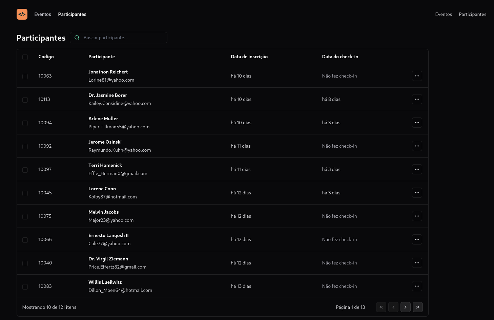

# Pass-in

## Desenvolvimento de uma aplicação front-end em ReactJS

   

# Funcionalidades

* Adicionar produto na tabela

* Excluir produto

* Toasts de notificação

# Tecnologias Utilizadas

* ReactJS - Para construção da interface

* Node.js - Para consumir API

* JavaScript/TypeScript - Para lógica de programação e tipagem 

* TailwindCSS - Para estilização da interface

* Tooling com Vite

# Conceitos Abordados

* Uso de URL states

* Consumo de API Node.js

* Propriedades
  
* Estatados
  
* Componentes

# Como utilizar

1- Clone o projeto
`git@github.com:helen-andrade/Pass-in.git`

2- Instale as dependências
`npm i`

3- Rode o script de desenvolvimento
`npm run dev`

---

    
Feito com ♡ por Helen Andrade

